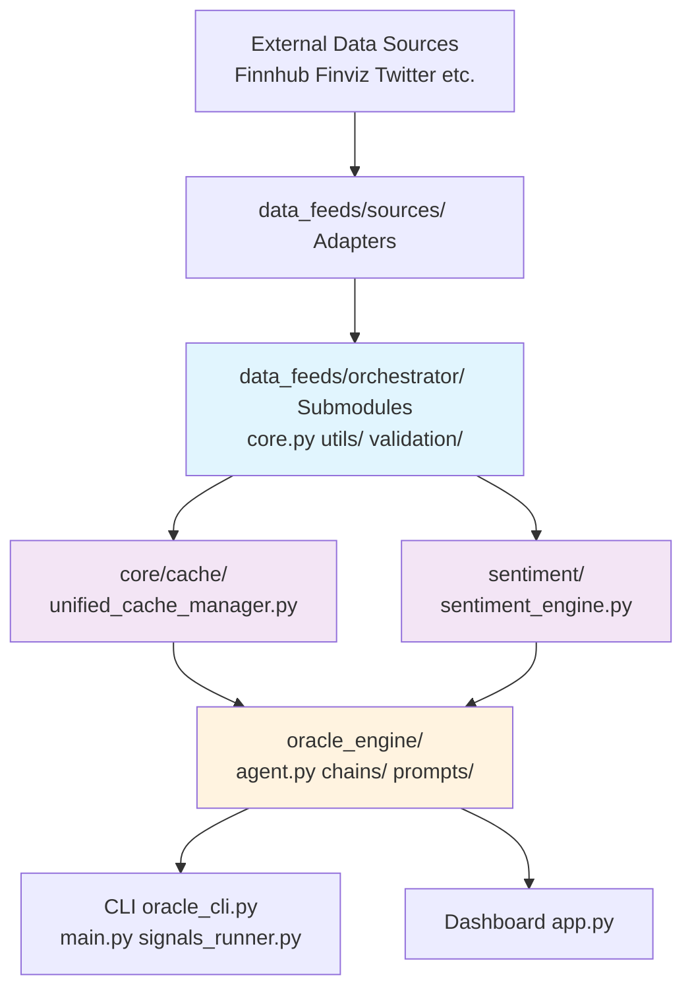

# ORACLE-X

## Project Overview
ORACLE-X is an AI-driven trading scenario engine that integrates real-time market data, options flow, sentiment, and anomaly detection to generate actionable playbooks and dashboards for traders.

## Structure
- **main.py**: Unified main entry point supporting multiple execution modes (standard, enhanced, optimized).
- **signals_runner.py**: Collects and saves daily signals from all data feeds.
- **oracle_cli.py**: Unified CLI interface for all Oracle-X operations (options, optimization, validation, etc.).
- **dashboard/app.py**: Streamlit dashboard for visualizing playbooks and signals.
- **backtest_tracker/**: Tools for backtesting and analyzing playbook performance.
- **data_feeds/**: Modular scrapers and data orchestrator for market data, options flow, sentiment, etc.
- **oracle_engine/**: Core agent logic, prompt chains, ML engines, and optimization systems.
- **vector_db/**: Qdrant vector store integration for scenario recall and prompt boosting.
- **config/**: Configuration files (settings.yaml, optimization configs, RSS feeds, etc.).
- **data/databases/**: SQLite databases for caching, model monitoring, and optimization tracking.
- **docs/**: Project documentation, reports, and SOPs.
- **scripts/**: Utility scripts organized by type (diagnostics, demos, analysis).
- **examples/**: Example implementations and training scripts.
- **tests/**: Comprehensive test suite with unit, integration, and validation tests.


## 🏗️ Post-Refactor Architecture (P1-P5 Complete)



### Unified Components
| Component | Path | Purpose |
|-----------|------|---------|
| **Unified Cache** | [`core/cache/unified_cache_manager.py`](core/cache/unified_cache_manager.py) | Multi-level caching (memory/redis/SQLite), invalidation, warming |
| **Sentiment Engine** | [`sentiment/sentiment_engine.py`](sentiment/sentiment_engine.py) | Aggregates Reddit/Twitter/news/FinBERT/VADER; composite scores |
| **Orchestrator Submodules** | [`data_feeds/orchestrator/`](data_feeds/orchestrator/) | core.py (main), utils/helpers.py performance_tracker.py, validation/data_validator.py |
| **Structured Exceptions** | Module-specific (e.g. DataFeedError patterns) | Replace generic try/except; better debugging/fallbacks |

### Changes Summary
From [`refactoring_plan.md`](refactoring_plan.md):
- **P1**: Split 4000+ line monolith → maintainable submodules.
- **P2**: Cache unification → single interface, no fragmentation.
- **P3**: Sentiment consolidation → one engine, no duplicates.
- **P4**: Error handling → specific exceptions.
- **P5**: Cleanup/dead code removal.
- **Validation**: pytest 100%, perf stable.

**AI Agents**: Follow [`docs/copilot-instructions.md`](docs/copilot-instructions.md) for patterns.

## Setup
1. Install dependencies:
   ```sh
   pip install -r requirements.txt
   ```
2. Configure API keys and endpoints in `config/settings.yaml` as needed.
3. Run the signals scraper:
   ```sh
   python signals_runner.py
   ```
4. Generate a playbook:
   ```sh
   python main.py
   ```
5. Launch the dashboard:
   ```sh
   streamlit run dashboard/app.py
   ```

## Notes
- Replace all TODOs in data_feeds with real data sources for production use.
- Backtesting tools are available in `backtest_tracker/` but not integrated into the main pipeline by default.
- See `docs/` for detailed SOPs and architecture.

## ⚙️ How to Run

### 1️⃣ Install Dependencies

```bash
python -m venv venv
source venv/bin/activate  # Mac/Linux
# OR
venv\Scripts\activate  # Windows

pip install -r requirements.txt
```

2️⃣ Set Your OpenAI API Key
bash
Copy
Edit
export OPENAI_API_KEY="YOUR_API_KEY_HERE"  # Mac/Linux
# OR
setx OPENAI_API_KEY "YOUR_API_KEY_HERE"    # Windows

3️⃣ Place a Chart Image
Add your overnight chart screenshot (e.g., futures, dark pool flow) to your project folder.
Update example_chart.png in main.py with your actual file name.

4️⃣ Run It
bash
Copy
Edit
python main.py
You’ll see your daily ORACLE-X AGENT PLAYBOOK in your console, with:

1–3 best trades

Entries, profit targets, stop-losses

Scenario tree

Tomorrow’s Tape summary

## 🖥️ CLI Control (Recommended)

For centralized control of all pipelines, use the unified CLI:

```bash
# Run individual pipelines
python oracle_cli.py pipeline run --mode standard    # Main trading playbook
python oracle_cli.py pipeline run --mode signals     # Market signals snapshot
python oracle_cli.py pipeline run --mode options     # Options analysis

# Run all pipelines sequentially
python oracle_cli.py pipeline run --mode all

# Run in background (for long-running processes)
python oracle_cli.py pipeline run --mode standard --background

# Get help
python oracle_cli.py --help
python oracle_cli.py pipeline --help
```

The CLI provides:
- ✅ **Centralized Control**: Single interface for all pipelines
- ✅ **Error Handling**: Graceful failure handling and status reporting
- ✅ **Background Execution**: Run pipelines in background for automation
- ✅ **Status Monitoring**: Check pipeline status and health

✅ 5️⃣ 🕒 Hook your pipeline into a cron job (Mac/Linux)
1️⃣ Edit your cron:

bash
Copy
Edit
crontab -e
2️⃣ Add:

cron
Copy
Edit
# Run Oracle-X daily at 6PM Eastern (adjust as needed)
0 18 * * * cd /path/to/oracle-x && /usr/bin/python3 oracle_cli.py pipeline run --mode all >> cronlog.txt 2>&1
3️⃣ Add your backtest:

cron
Copy
Edit
# Run backtest daily after the market close
0 19 * * * cd /path/to/oracle-x && /usr/bin/python3 backtest_tracker/backtest.py >> backtestlog.txt 2>&1
0 19 * * * cd /path/to/oracle-x && /usr/bin/python3 backtest_tracker/results_analyzer.py >> backtestlog.txt 2>&1
✅ That’s it — your clairvoyant pipeline:

Generates tomorrow’s tape → saves Playbook → backtests → self-corrects.

# Run after your backtest finishes
0 19 * * * cd /path/to/oracle-x && /usr/bin/python3 backtest_tracker/results_dashboard.py >> dashboardlog.txt 2>&1


🧩 Advanced: Expand It
✅ Connect real Twitter/X and Reddit sentiment scrapers
✅ Automate fetching charts from your broker API
✅ Pipe your playbook to a local vector DB for backtesting
✅ Build a local Streamlit dashboard to monitor signals overnight

🚀 Your Edge Starts Here
No more guesswork. No stale tips.
A daily, evolving, LLM-powered clairvoyant edge — 100% under your control.
Refine, plug in more tools, and test until it feels uncanny.

🪙 Disclaimer
This is not financial advice. This is a technical demo and research tool only.
Trade smart. Test everything. The market eats careless traders for breakfast.

## CLI Validation

Use the CLI utility to query each cataloged data point and paste results into `docs/DATA_VALIDATION_CHECKLIST.md`.

Examples:
- Quote
  - `python cli_validate.py quote --symbol AAPL`
- Market Data
  - `python cli_validate.py market_data --symbol AAPL --period 1y --interval 1d --preferred_sources twelve_data`
- Company Info
  - `python cli_validate.py company_info --symbol MSFT`
- News
  - `python cli_validate.py news --symbol AAPL --limit 5`
- Multiple Quotes
  - `python cli_validate.py multiple_quotes --symbols AAPL,MSFT,SPY`
- Financial Statements
  - `python cli_validate.py financial_statements --symbol AAPL`
- Sentiment (basic)
  - `python cli_validate.py sentiment --symbol TSLA`
- Advanced Sentiment
  - `python cli_validate.py advanced_sentiment --symbol TSLA`
- Market Breadth
  - `python cli_validate.py market_breadth`
- Sector Performance
  - `python cli_validate.py sector_performance`
- Comparison helper
  - `python cli_validate.py compare --value 195.23 --ref_value 196.5 --tolerance_pct 2.0`

Paste the raw JSON outputs into the “Execution Log” section of `docs/DATA_VALIDATION_CHECKLIST.md`, then update each scenario row with:
- Retrieved: source, timestamp, value summary
- Web Reference: a URL and value snapshot
- Pct Diff + Pass/Fail: use the compare helper to compute tolerance-based result
- Notes: anomalies, cache usage, or “skipped (missing key)” where applicable

## 🧠 Advanced Sentiment Enhancements (New)

The advanced sentiment pipeline aggregates multi-source textual signals before the ensemble (VADER + FinBERT + financial lexicon heuristics). **Available sources**: Reddit, Twitter/X, Yahoo Finance headlines, FinViz headlines, Yahoo News sentiment adapter sample texts, and Generic RSS feeds.

### Key Capabilities
- Per‑source cap (env: `ADVANCED_SENTIMENT_MAX_PER_SOURCE`, default 300)
- Text truncation (256 chars) to control token cost
- Deduplication across sources
- Global truncation (3 × per‑source cap)
- Metadata: `raw_data['aggregated_counts']` with per-source counts + `total_unique`

Environment variables:
| Variable | Purpose | Default |
|----------|---------|---------|
| `ADVANCED_SENTIMENT_MAX_PER_SOURCE` | Max texts per source | `300` |
| `RSS_FEEDS` | Comma-separated RSS feed URLs | (empty) |
| `RSS_INCLUDE_ALL` | Include RSS headlines even without symbol match | `0` |

Example:
```bash
export ADVANCED_SENTIMENT_MAX_PER_SOURCE=120
export RSS_FEEDS="https://news.google.com/rss?hl=en-US&gl=US&ceid=US:en"
export RSS_INCLUDE_ALL=1
python cli_validate.py advanced_sentiment --symbol TSLA
```

Inspect counts:
```bash
python -c "from data_feeds.data_feed_orchestrator import DataFeedOrchestrator; o=DataFeedOrchestrator(); adv=o.get_advanced_sentiment_data('AAPL'); import json; print(json.dumps(adv.raw_data.get('aggregated_counts',{}), indent=2))"
```

The FinViz ambiguous DataFrame truth-value path has been refactored to explicit sequential checks, eliminating prior warnings.

## 🎯 Oracle-X Options Prediction Pipeline

The Oracle Options Pipeline is a unified system for identifying optimal stock options to purchase by combining valuation analysis, machine learning predictions, and comprehensive risk assessment.

### 📊 Key Features

- **Multi-Model Valuation**: Uses Black-Scholes, Binomial, and Monte Carlo models for consensus pricing
- **ML-Powered Predictions**: Integrates ensemble machine learning for price movement prediction
- **Advanced Sentiment Analysis**: Aggregates sentiment from Reddit, Twitter, news, and custom RSS feeds for high-quality financial sentiment
- **Risk Management**: Comprehensive risk assessment with position sizing based on Kelly Criterion
- **Real-Time & Batch Processing**: Supports both single-ticker analysis and market-wide scanning
- **Portfolio Optimization**: Suggests position sizes and hedging strategies

### 🚀 Quick Start

#### Installation

```bash
# Ensure all dependencies are installed
pip install -r requirements.txt

# Set up environment variables (optional)
export OPENAI_API_KEY="your-key-here"
export FINANCIALMODELINGPREP_API_KEY="your-key-here"
export FINNHUB_API_KEY="your-key-here"
```

#### Basic Usage

```python
from oracle_options_pipeline import create_pipeline

# Create pipeline with default configuration
pipeline = create_pipeline()

# Analyze a single ticker
recommendations = pipeline.analyze_ticker("AAPL")

# Display top opportunity
if recommendations:
    top = recommendations[0]
    print(f"Best opportunity: {top.symbol} {top.contract.option_type.value}")
    print(f"Score: {top.opportunity_score:.1f}/100")
    print(f"Entry: ${top.entry_price:.2f}, Target: ${top.target_price:.2f}")
```

### 💻 Command Line Interface

The pipeline includes a comprehensive CLI for easy interaction:

#### Analyze Single Ticker
```bash
# Basic analysis
python oracle_options_cli.py analyze AAPL

# With custom parameters
python oracle_options_cli.py analyze AAPL \
    --limit 10 \
    --min-score 75 \
    --risk conservative \
    --verbose

# Save results to file
python oracle_options_cli.py analyze AAPL --output aapl_opportunities.json
```

#### Scan Market for Opportunities
```bash
# Scan default universe (top liquid options)
python oracle_options_cli.py scan --top 10

# Scan specific symbols
python oracle_options_cli.py scan \
    --symbols AAPL,MSFT,GOOGL,NVDA \
    --min-score 80 \
    --risk moderate

# Save scan results
python oracle_options_cli.py scan --output market_scan.json
```

#### Monitor Existing Positions
```bash
# Create positions file (positions.json)
cat > positions.json << EOF
[
  {
    "symbol": "AAPL",
    "strike": 180.0,
    "expiry": "2024-12-20",
    "type": "call",
    "entry_price": 5.50,
    "quantity": 10
  }
]
EOF

# Monitor positions
python oracle_options_cli.py monitor positions.json
```

### 🔧 Configuration

Create custom configurations for different trading styles:

```python
from oracle_options_pipeline import create_pipeline, RiskTolerance

# Conservative configuration
conservative_config = {
    'risk_tolerance': 'conservative',
    'max_position_size': 0.02,  # 2% max position
    'min_opportunity_score': 80.0,
    'min_confidence': 0.7,
    'min_days_to_expiry': 30,
    'max_days_to_expiry': 120
}

pipeline = create_pipeline(conservative_config)

# Aggressive configuration
aggressive_config = {
    'risk_tolerance': 'aggressive',
    'max_position_size': 0.10,  # 10% max position
    'min_opportunity_score': 65.0,
    'min_confidence': 0.5,
    'min_days_to_expiry': 7,
    'max_days_to_expiry': 45
}

pipeline = create_pipeline(aggressive_config)
```

### 📈 Pipeline Workflow

1. **Data Collection**: Fetches market data, options chains, and sentiment from multiple sources
2. **Valuation Analysis**: Calculates fair values using multiple pricing models
3. **Signal Generation**: Aggregates technical, flow, and sentiment signals
4. **ML Prediction**: Predicts price movement probability using ensemble models
5. **Opportunity Scoring**: Combines all scores with risk assessment (0-100 scale)
6. **Recommendation**: Generates actionable trade recommendations with entry/exit points

### 📋 Output Format

Each recommendation includes:

```json
{
  "symbol": "AAPL",
  "contract": {
    "strike": 180.0,
    "expiry": "2024-12-20",
    "type": "call",
    "volume": 5234,
    "open_interest": 12453
  },
  "scores": {
    "opportunity": 85.3,
    "ml_confidence": 0.762,
    "valuation": 0.152
  },
  "trade": {
    "entry_price": 5.45,
    "target_price": 8.20,
    "stop_loss": 3.80,
    "position_size": 0.032,
    "max_contracts": 10
  },
  "risk": {
    "max_loss": 545.0,
    "expected_return": 0.504,
    "probability_of_profit": 0.652,
    "risk_reward_ratio": 2.14,
    "breakeven_price": 185.45
  },
  "analysis": {
    "key_reasons": [
      "Undervalued by 15.2%",
      "High ML confidence: 76.2%",
      "Low IV rank: 28"
    ],
    "risk_factors": [
      "Time decay risk",
      "Earnings in 2 weeks"
    ]
  }
}
```

### 🧪 Running Tests

```bash
# Run all integration tests
python test_oracle_options_pipeline.py

# Run with pytest for more detailed output
pytest test_oracle_options_pipeline.py -v

# Run specific test class
pytest test_oracle_options_pipeline.py::TestPipelineAnalysis -v
```

### 📚 Examples

See `example_options_trading.py` for comprehensive examples including:

1. **Basic Analysis**: Single ticker opportunity identification
2. **Conservative Trading**: Blue-chip options with strict risk limits
3. **Market Scanning**: Finding opportunities across multiple symbols
4. **Position Monitoring**: Tracking existing positions for exit signals
5. **Advanced Filtering**: High-confidence opportunity selection
6. **Performance Statistics**: Pipeline performance metrics

Run all examples:
```bash
python example_options_trading.py
```

### ⚙️ Advanced Features

#### Custom Signal Integration
```python
# Add custom signals to the pipeline
pipeline = create_pipeline()

# Access internal components
valuation_engine = pipeline.valuation_engine
signal_aggregator = pipeline.signal_aggregator
orchestrator = pipeline.orchestrator

# Get advanced sentiment
sentiment = orchestrator.get_advanced_sentiment_data("AAPL")
```

#### Batch Processing
```python
# Process multiple symbols efficiently
symbols = ["AAPL", "GOOGL", "MSFT", "NVDA", "TSLA"]
result = pipeline.scan_market(symbols, max_symbols=len(symbols))

print(f"Found {result.opportunities_found} opportunities")
print(f"Execution time: {result.execution_time:.2f}s")
```

#### Position Sizing with Kelly Criterion
```python
# The pipeline automatically calculates optimal position sizes
rec = recommendations[0]
print(f"Suggested position: {rec.position_size:.1%} of portfolio")
print(f"Max contracts: {rec.max_contracts}")
print(f"Max loss: ${rec.max_loss:.2f}")
```

### 🔍 Performance Metrics

The pipeline tracks performance metrics:

```python
# Get performance statistics
stats = pipeline.get_performance_stats()
print(f"Cache size: {stats['cache_size']}")
print(f"Avg opportunity score: {stats['avg_opportunity_score']:.1f}")
print(f"Avg ML confidence: {stats['avg_ml_confidence']:.1%}")
```

### ⚠️ Important Notes

1. **Risk Management**: Always validate recommendations with your own analysis
2. **Market Hours**: Best results during market hours when data is fresh
3. **API Limits**: Be mindful of rate limits when scanning many symbols
4. **Paper Trading**: Test strategies with paper trading before using real money

### 🛠️ Troubleshooting

Common issues and solutions:

1. **No opportunities found**: Lower `min_opportunity_score` or expand search criteria
2. **Slow performance**: Reduce `max_workers` or implement caching
3. **API errors**: Check API keys and rate limits
4. **Missing data**: Ensure market is open or use cached data

### 📄 License & Disclaimer

This is a research and educational tool. Not financial advice. Always conduct your own due diligence before making investment decisions. Options trading involves substantial risk and is not suitable for all investors.
