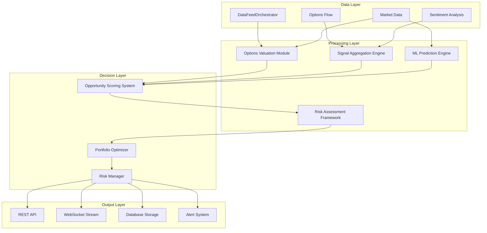
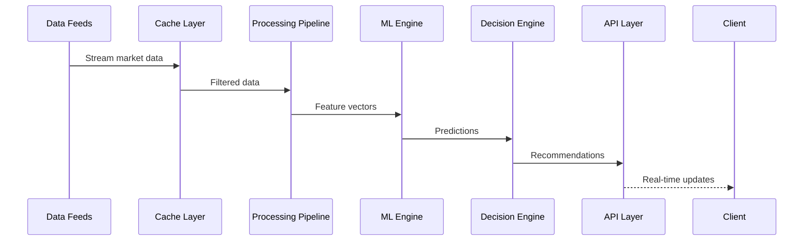
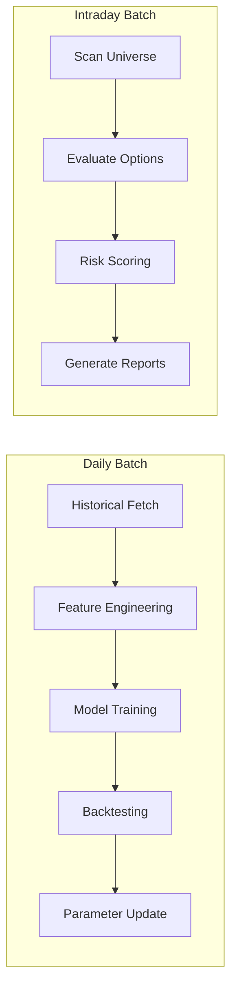

# Oracle-X Options Prediction Pipeline Architecture

## Executive Summary

This document defines the architecture for a comprehensive stock options prediction pipeline that identifies optimally priced options with high probability of value increase. The system leverages existing Oracle-X components including real-time data feeds, options mathematics, ensemble ML models, and sentiment analysis to deliver actionable options trading recommendations.

## 1. System Overview

### 1.1 Core Objectives
- **Primary Goal**: Identify undervalued options with high profit potential
- **Risk Management**: Assess and quantify risk for each opportunity
- **Portfolio Optimization**: Suggest position sizes and hedging strategies
- **Real-time Processing**: Support both streaming and batch processing modes

### 1.2 High-Level Architecture



## 2. Component Architecture

### 2.1 Options Valuation Module

**Purpose**: Compare market prices to theoretical fair values using multiple pricing models

**Components**:
```python
class OptionsValuationModule:
    """
    Calculates theoretical option values and identifies mispricing
    """
    
    def __init__(self):
        self.pricing_models = {
            'black_scholes': BlackScholesModel(),
            'binomial': BinomialModel(),
            'monte_carlo': MonteCarloModel()
        }
        self.iv_calculator = ImpliedVolatilityCalculator()
        self.greeks_engine = GreeksCalculator()
    
    def evaluate_option(self, option_data: OptionContract) -> ValuationResult:
        """
        Returns:
            - theoretical_value: float
            - market_price: float
            - mispricing_ratio: float
            - confidence_score: float
            - greeks: Dict[str, float]
        """
```

**Key Features**:
- Multi-model consensus pricing
- Real-time IV surface modeling
- Greeks calculation with sensitivities
- Historical volatility comparison
- Dividend and rate adjustments

### 2.2 Signal Aggregation Engine

**Purpose**: Combine multiple prediction signals with intelligent weighting

**Architecture**:
```python
class SignalAggregationEngine:
    """
    Aggregates and weights signals from multiple sources
    """
    
    def __init__(self):
        self.signal_sources = {
            'technical': TechnicalSignalGenerator(),
            'fundamental': FundamentalSignalGenerator(),
            'sentiment': SentimentSignalGenerator(),
            'flow': OptionsFlowSignalGenerator(),
            'ml_predictions': MLSignalGenerator()
        }
        self.weight_optimizer = DynamicWeightOptimizer()
    
    def aggregate_signals(self, symbol: str, expiry: str) -> AggregatedSignal:
        """
        Returns:
            - composite_score: float (-1 to 1)
            - signal_breakdown: Dict[str, float]
            - confidence: float
            - signal_strength: str (weak/moderate/strong)
        """
```

**Signal Types**:
1. **Technical Signals**
   - Price momentum
   - Volume patterns
   - Support/resistance levels
   - Technical indicators (RSI, MACD, etc.)

2. **Fundamental Signals**
   - Earnings expectations
   - Company financials
   - Sector performance
   - Economic indicators

3. **Sentiment Signals**
   - Social media sentiment
   - News sentiment
   - Options sentiment (put/call ratio)
   - Analyst ratings

4. **Options Flow Signals**
   - Unusual options activity
   - Large block trades
   - Smart money indicators
   - Open interest changes

### 2.3 Opportunity Scoring System

**Purpose**: Rank options by expected return and probability of success

**Scoring Algorithm**:
```python
class OpportunityScoringSystem:
    """
    Scores and ranks options opportunities
    """
    
    def calculate_opportunity_score(self, option: OptionOpportunity) -> OpportunityScore:
        """
        Score Components:
        - Expected Return Score (0-100)
        - Probability of Profit (0-100)
        - Risk-Adjusted Return (Sharpe Ratio)
        - Time Decay Factor
        - Liquidity Score
        - Signal Strength
        """
        
        score = (
            self.expected_return_weight * expected_return_score +
            self.probability_weight * probability_score +
            self.risk_weight * risk_adjusted_score +
            self.liquidity_weight * liquidity_score +
            self.signal_weight * signal_strength
        )
        
        return OpportunityScore(
            total_score=score,
            components=component_scores,
            confidence=confidence_level,
            recommendation=self.get_recommendation(score)
        )
```

**Scoring Factors**:
- **Expected Return**: (Target Price - Current Price) / Current Price
- **Win Probability**: ML model confidence + historical success rate
- **Risk Score**: Max drawdown, volatility, Greeks exposure
- **Liquidity**: Bid-ask spread, volume, open interest
- **Time Value**: Days to expiry, theta decay rate

### 2.4 Risk Assessment Framework

**Purpose**: Comprehensive risk analysis for each opportunity

**Risk Metrics**:
```python
class RiskAssessmentFramework:
    """
    Calculates comprehensive risk metrics
    """
    
    def assess_risk(self, position: OptionPosition) -> RiskProfile:
        return RiskProfile(
            max_loss=self.calculate_max_loss(position),
            probability_of_loss=self.calculate_loss_probability(position),
            value_at_risk=self.calculate_var(position, confidence=0.95),
            conditional_var=self.calculate_cvar(position, confidence=0.95),
            stress_test_results=self.run_stress_tests(position),
            correlation_risk=self.assess_correlation_risk(position),
            liquidity_risk=self.assess_liquidity_risk(position),
            assignment_risk=self.calculate_assignment_risk(position)
        )
```

**Risk Categories**:
1. **Market Risk**
   - Delta risk (price movement)
   - Gamma risk (acceleration)
   - Vega risk (volatility)
   - Rho risk (interest rates)

2. **Liquidity Risk**
   - Bid-ask spread widening
   - Volume deterioration
   - Market impact cost

3. **Event Risk**
   - Earnings announcements
   - Economic data releases
   - Corporate actions

### 2.5 Portfolio Optimization Module

**Purpose**: Optimize position sizing and suggest hedging strategies

**Optimization Engine**:
```python
class PortfolioOptimizer:
    """
    Optimizes portfolio allocation and hedging
    """
    
    def optimize_portfolio(self, 
                          opportunities: List[OptionOpportunity],
                          constraints: PortfolioConstraints) -> PortfolioAllocation:
        """
        Uses Modern Portfolio Theory with options-specific adjustments
        """
        
        return PortfolioAllocation(
            positions=self.calculate_optimal_positions(opportunities),
            position_sizes=self.calculate_position_sizes(risk_budget),
            hedges=self.suggest_hedges(positions),
            expected_return=portfolio_return,
            expected_risk=portfolio_risk,
            sharpe_ratio=sharpe,
            max_drawdown=max_dd
        )
```

**Optimization Constraints**:
- Maximum position size (% of portfolio)
- Sector concentration limits
- Greeks exposure limits
- Correlation thresholds
- Liquidity requirements

## 3. Data Flow Architecture

### 3.1 Real-time Processing Pipeline



### 3.2 Batch Processing Pipeline



## 4. Data Schemas

### 4.1 Core Data Models

```python
@dataclass
class OptionContract:
    symbol: str
    strike: float
    expiry: datetime
    option_type: str  # 'call' or 'put'
    bid: float
    ask: float
    last: float
    volume: int
    open_interest: int
    implied_volatility: float
    greeks: Greeks
    
@dataclass
class Greeks:
    delta: float
    gamma: float
    theta: float
    vega: float
    rho: float

@dataclass
class OptionOpportunity:
    contract: OptionContract
    valuation: ValuationResult
    signals: AggregatedSignal
    score: OpportunityScore
    risk_profile: RiskProfile
    metadata: Dict[str, Any]

@dataclass
class PredictionSignal:
    source: str
    signal_type: str
    value: float  # -1 to 1
    confidence: float
    timestamp: datetime
    metadata: Dict[str, Any]
```

### 4.2 API Response Schemas

```python
class OptionRecommendation:
    """API response for option recommendations"""
    
    recommendation_id: str
    timestamp: datetime
    contract: OptionContract
    action: str  # 'buy', 'sell', 'hold'
    
    scores: {
        'opportunity_score': float,
        'risk_score': float,
        'expected_return': float,
        'win_probability': float
    }
    
    analysis: {
        'valuation': ValuationResult,
        'signals': Dict[str, float],
        'risk_metrics': RiskProfile,
        'position_sizing': PositionSize
    }
    
    metadata: {
        'confidence': float,
        'market_regime': str,
        'key_factors': List[str],
        'warnings': List[str]
    }
```

## 5. System Interfaces

### 5.1 Internal Component Interfaces

```python
class IDataProvider(Protocol):
    """Interface for data providers"""
    def get_options_chain(self, symbol: str, expiry: str) -> pd.DataFrame: ...
    def get_market_data(self, symbol: str) -> MarketData: ...
    def get_options_flow(self, symbol: str) -> OptionsFlow: ...

class IValuationModel(Protocol):
    """Interface for valuation models"""
    def calculate_fair_value(self, option: OptionContract) -> float: ...
    def calculate_greeks(self, option: OptionContract) -> Greeks: ...

class ISignalGenerator(Protocol):
    """Interface for signal generators"""
    def generate_signal(self, symbol: str, data: Any) -> PredictionSignal: ...

class IRiskModel(Protocol):
    """Interface for risk models"""
    def calculate_risk(self, position: Position) -> RiskMetrics: ...
```

### 5.2 External API Endpoints

```yaml
REST API Endpoints:
  /api/v1/opportunities:
    GET: List current opportunities
    params:
      - symbols: List[str]
      - min_score: float
      - max_risk: float
      - strategies: List[str]
  
  /api/v1/opportunity/{id}:
    GET: Detailed opportunity analysis
    
  /api/v1/portfolio/optimize:
    POST: Optimize portfolio allocation
    body:
      - opportunities: List[OpportunityId]
      - constraints: PortfolioConstraints
      
  /api/v1/risk/assess:
    POST: Assess position risk
    body:
      - positions: List[Position]
      - scenarios: List[Scenario]

WebSocket Streams:
  /ws/opportunities:
    Real-time opportunity updates
    
  /ws/signals:
    Real-time signal updates
    
  /ws/risk:
    Real-time risk alerts
```

## 6. Configuration Parameters

### 6.1 System Configuration

```yaml
system:
  mode: "hybrid"  # real-time, batch, hybrid
  processing_interval: 60  # seconds
  cache_ttl: 300  # seconds
  max_concurrent_evaluations: 100
  
data_sources:
  market_data:
    providers: ["yfinance", "twelve_data", "finviz"]
    fallback_enabled: true
    quality_threshold: 0.8
    
  options_data:
    providers: ["yfinance"]
    update_frequency: 300  # seconds
    
  sentiment_data:
    providers: ["reddit", "twitter", "news"]
    aggregation_method: "weighted_average"
```

### 6.2 Model Parameters

```yaml
valuation:
  models:
    black_scholes:
      enabled: true
      weight: 0.4
    binomial:
      enabled: true
      weight: 0.3
      steps: 100
    monte_carlo:
      enabled: true
      weight: 0.3
      simulations: 10000
      
  risk_free_rate: 0.05
  dividend_yield: "auto"  # or fixed value
  
signal_aggregation:
  weights:
    technical: 0.25
    fundamental: 0.20
    sentiment: 0.20
    options_flow: 0.20
    ml_predictions: 0.15
    
  min_signal_confidence: 0.6
  signal_decay_hours: 24
```

### 6.3 Risk Parameters

```yaml
risk_management:
  max_position_size: 0.05  # 5% of portfolio
  max_sector_exposure: 0.30  # 30% in one sector
  max_correlation: 0.70
  
  var_confidence: 0.95
  stress_test_scenarios:
    - market_crash: -20%
    - volatility_spike: +50%
    - liquidity_crisis: -80%
    
  stop_loss:
    enabled: true
    percentage: 0.20  # 20% loss
    
  greeks_limits:
    portfolio_delta: [-0.3, 0.3]
    portfolio_gamma: [-0.1, 0.1]
    portfolio_vega: [-0.2, 0.2]
```

### 6.4 Scoring Parameters

```yaml
scoring:
  weights:
    expected_return: 0.30
    win_probability: 0.25
    risk_adjusted_return: 0.20
    liquidity: 0.15
    signal_strength: 0.10
    
  thresholds:
    min_opportunity_score: 70
    min_liquidity_score: 60
    min_win_probability: 0.55
    
  filters:
    min_volume: 100
    min_open_interest: 500
    max_spread_percentage: 0.05
    min_days_to_expiry: 7
    max_days_to_expiry: 90
```

## 7. Performance Optimization

### 7.1 Caching Strategy

```python
class CacheStrategy:
    """Multi-tier caching for performance"""
    
    tiers = {
        'L1_memory': {
            'ttl': 60,  # seconds
            'size': '1GB',
            'data': ['hot_opportunities', 'active_signals']
        },
        'L2_redis': {
            'ttl': 300,
            'size': '10GB',
            'data': ['options_chains', 'valuations', 'risk_profiles']
        },
        'L3_database': {
            'ttl': 86400,
            'size': 'unlimited',
            'data': ['historical_data', 'model_outputs', 'reports']
        }
    }
```

### 7.2 Parallel Processing

```python
class ParallelProcessor:
    """Parallel processing for scalability"""
    
    def process_opportunities(self, symbols: List[str]):
        with ThreadPoolExecutor(max_workers=10) as executor:
            futures = []
            for symbol in symbols:
                future = executor.submit(self.evaluate_symbol, symbol)
                futures.append(future)
            
            results = []
            for future in as_completed(futures):
                results.append(future.result())
        
        return results
```

### 7.3 Resource Management

```yaml
resources:
  cpu:
    evaluation_threads: 8
    ml_inference_threads: 4
    data_processing_threads: 4
    
  memory:
    max_heap_size: "8GB"
    cache_size: "2GB"
    model_cache: "1GB"
    
  database:
    connection_pool_size: 20
    query_timeout: 30  # seconds
    
  api:
    rate_limiting:
      requests_per_minute: 1000
      burst_size: 100
```

## 8. Monitoring and Alerting

### 8.1 Key Metrics

```yaml
monitoring:
  system_metrics:
    - cpu_usage
    - memory_usage
    - api_latency
    - processing_queue_size
    
  business_metrics:
    - opportunities_identified
    - recommendation_accuracy
    - portfolio_performance
    - risk_violations
    
  data_quality_metrics:
    - data_freshness
    - data_completeness
    - model_drift_score
    - signal_correlation
```

### 8.2 Alert Conditions

```yaml
alerts:
  critical:
    - system_down
    - data_feed_failure
    - risk_limit_breach
    - model_failure
    
  warning:
    - high_latency
    - low_data_quality
    - model_drift_detected
    - unusual_market_conditions
    
  info:
    - new_opportunity_found
    - position_update_recommended
    - model_retrained
```

## 9. Security Considerations

### 9.1 Data Security
- Encryption at rest and in transit
- API authentication (OAuth2/JWT)
- Rate limiting and DDoS protection
- Audit logging for all transactions

### 9.2 Trading Security
- Position limit enforcement
- Risk limit validation
- Order validation before execution
- Emergency stop mechanisms

## 10. Deployment Architecture

### 10.1 Container Architecture

```yaml
services:
  data-orchestrator:
    image: oracle-x/data-orchestrator:latest
    replicas: 2
    resources:
      cpu: 2
      memory: 4GB
      
  valuation-engine:
    image: oracle-x/valuation-engine:latest
    replicas: 3
    resources:
      cpu: 4
      memory: 8GB
      
  ml-engine:
    image: oracle-x/ml-engine:latest
    replicas: 2
    resources:
      cpu: 8
      memory: 16GB
      gpu: optional
      
  api-gateway:
    image: oracle-x/api-gateway:latest
    replicas: 3
    resources:
      cpu: 2
      memory: 2GB
```

### 10.2 Scaling Strategy

```yaml
autoscaling:
  horizontal:
    min_replicas: 2
    max_replicas: 10
    target_cpu_utilization: 70%
    target_memory_utilization: 80%
    
  vertical:
    enabled: true
    max_cpu: 16
    max_memory: 32GB
```

## 11. Future Enhancements

### Phase 2 Features
- Multi-leg options strategies (spreads, straddles, etc.)
- Advanced Greeks modeling (2nd and 3rd order)
- Market maker integration
- Automated execution system
- Advanced portfolio rebalancing

### Phase 3 Features
- Deep learning models for price prediction
- Natural language processing for news events
- Reinforcement learning for strategy optimization
- Cross-asset correlation analysis
- High-frequency trading capabilities

## 12. Success Metrics

### Performance KPIs
- **Accuracy**: >65% win rate on recommendations
- **Return**: >20% annualized return
- **Sharpe Ratio**: >1.5
- **Max Drawdown**: <15%
- **Processing Latency**: <100ms for real-time signals

### Operational KPIs
- **System Uptime**: >99.9%
- **Data Quality Score**: >95%
- **Model Drift**: <5% monthly
- **API Response Time**: <200ms p95

## Conclusion

This architecture provides a robust, scalable foundation for identifying and capitalizing on options trading opportunities. By leveraging existing Oracle-X components and adding specialized options-focused modules, the system can deliver high-quality, risk-adjusted recommendations in real-time.

The modular design allows for incremental development and testing, while the comprehensive monitoring and risk management ensure safe operation in production environments. The system is designed to evolve with machine learning improvements and market changes, maintaining its edge in options trading.